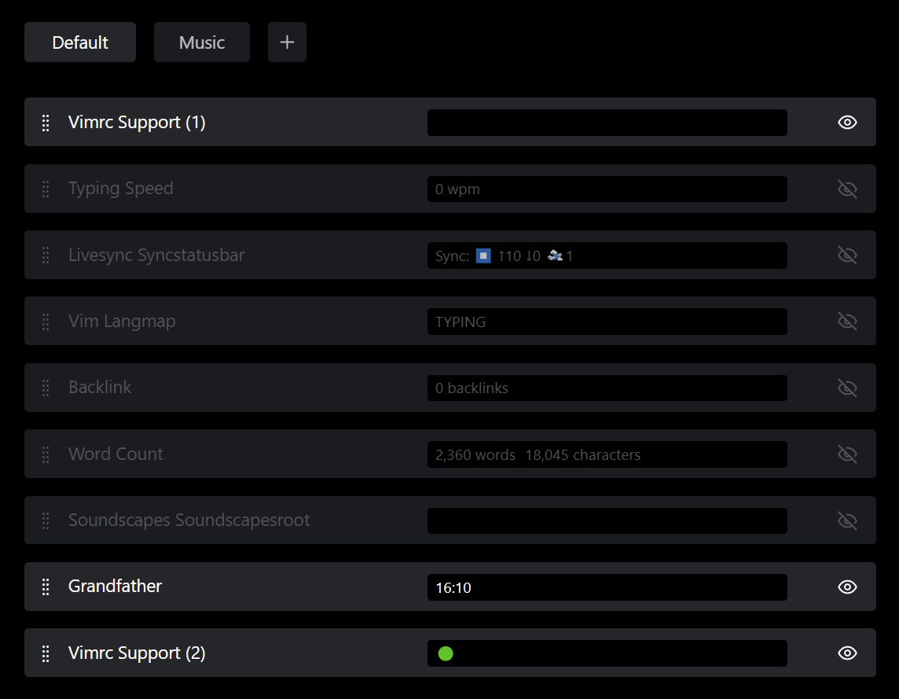
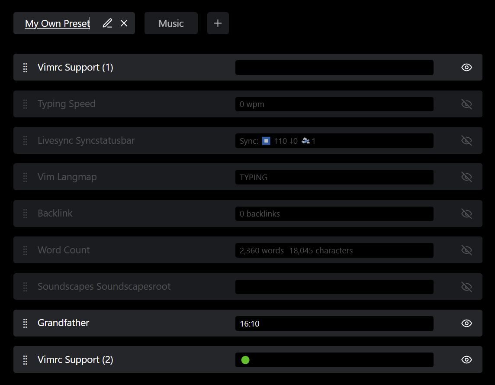
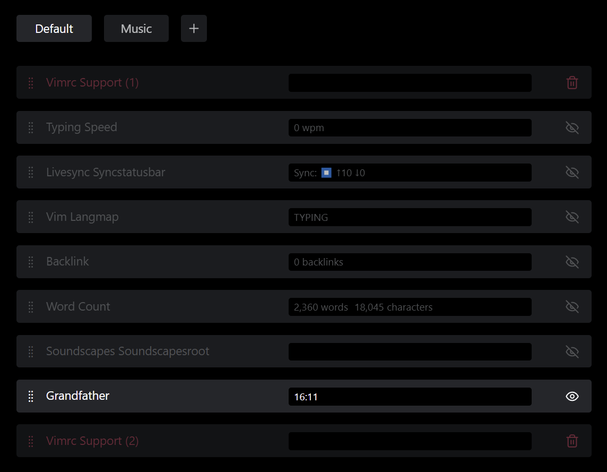

# Abstract
This plugin enables you to easily reorder elements of the status bar, as well as choose which to hide or show.

# Basic Usage
Once installed, simply enable the plugin and head to the "Status Bar Organizer" settings page.

You'll see a row for every element on your status bar.
Using the handle on the left side, you can drag and drop to change the order.
Using the eye on the right side, you can toggle visibility of the elements.

The changes you make will persist, even after restarting Obsidian.

# Deleting Plugins
If you delete some plugin which has a status bar element, its position will be remembered and will still be displayed on the settings page.
You can, however, simply click on the trash can symbol (where the visibility toggle previously was) to delete that entry.

# Presets
You can create multiple presets of your status bar by clicking the plus button in the top bar.
Switching between presets is accomplished by clicking the name of the preset you are interested in. The status bar and the settings page will automatically reflect that change.
Presets can be renamed and deleted with the pencil and cross buttons visible when hovering over the preset's entry in the top bar.
A planned feauture is to allow binding hotkeys to selected presets, as well as letting the user specify default presets for entering and exiting full-screen mode.

# Gallery

